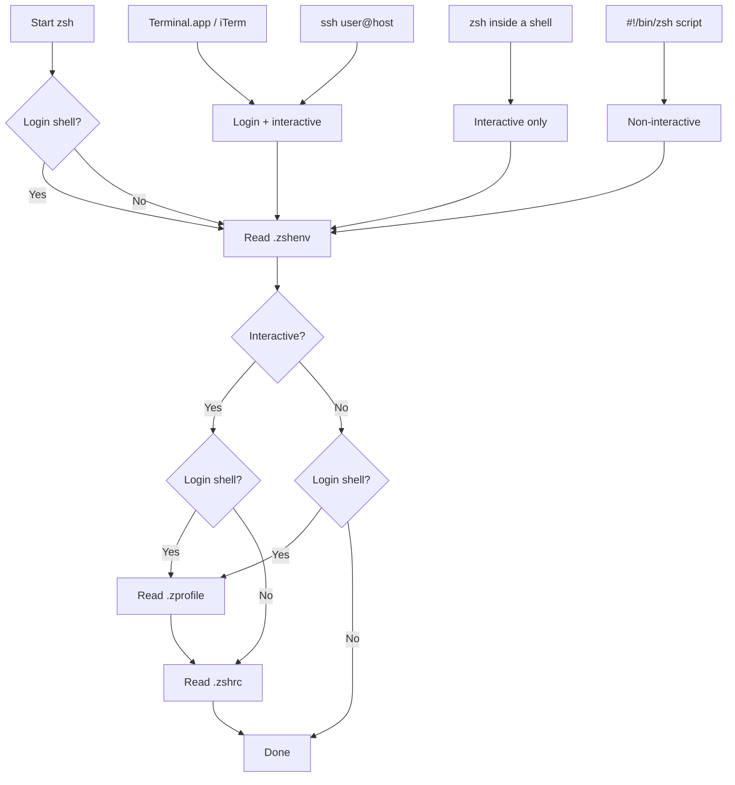

# dotfiles

Chezmoi-managed dotfiles for macOS, GitHub Codespaces, and Linux hosts.

## Install

**New machine (one-liner):**

```bash
sh -c "$(curl -fsLS get.chezmoi.io)" -- init --apply gillisandrew
```

**GitHub Codespaces:** Automatic — GitHub clones repos named `dotfiles` and runs `install.sh`.

## What's managed

| File | Notes |
|------|-------|
| `.zshrc`, `.zshenv`, `.zprofile` | Templated for macOS vs Linux |
| `.gitconfig` | Templated (email, signing, editor) |
| `.gitattributes`, `.gitignore` | Verbatim |
| `.config/atuin/config.toml` | Verbatim |
| `.config/gh/config.yml` | Verbatim |
| `.config/ghostty/themes/dracula` | macOS only |
| `.config/zed/settings.json` | macOS only |

## Shell startup (zsh)



**Gotchas and tips**
- Keep .zshenv minimal: it runs for every zsh invocation (including scripts and scp).
- Put PATH and toolchain exports in .zprofile to avoid duplication in subshells.
- Put prompt, aliases, completions, and slow tool init in .zshrc.
- If GUI apps need env vars on macOS, they may not inherit shell env (consider launchctl or app-specific config).

## Daily workflow

```bash
# Edit a dotfile (opens the source copy)
chezmoi edit ~/.zshrc

# Preview what would change
chezmoi diff

# Apply changes to home directory
chezmoi apply

# Commit and push
chezmoi cd
git add -A && git commit -m "update zshrc" && git push
```

## Pull updates on another machine

```bash
chezmoi update
```
