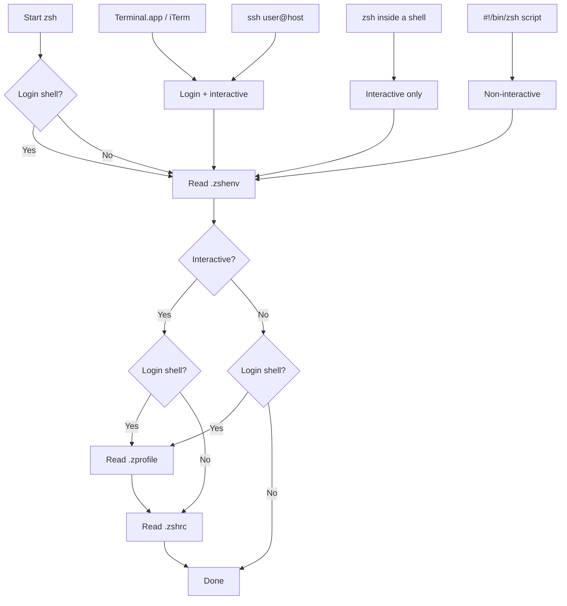

# dotfiles

Chezmoi-managed dotfiles for macOS, GitHub Codespaces, and Linux hosts.

## Install

**New machine (one-liner):**

```bash
sh -c "$(curl -fsLS get.chezmoi.io)" -- init --apply gillisandrew
```

On first run, chezmoi will prompt for:

| Prompt | Default | Notes |
|--------|---------|-------|
| Git email | *(none)* | Used in `.gitconfig` |
| Enable AWS SSO config | `true` | Set `false` to skip all AWS setup |
| AWS SSO session name | `zorg` | Only if AWS enabled |
| AWS SSO start URL | `https://<session>.awsapps.com/start` | Derived from session name |
| AWS SSO region | `us-east-1` | Only if AWS enabled |
| AWS SSO role name | `AdministratorAccess` | Only if AWS enabled |

To change answers later, edit `~/.config/chezmoi/chezmoi.toml` and run `chezmoi apply`.

**GitHub Codespaces:** Automatic — GitHub clones repos named `dotfiles` and runs `install.sh`. All prompts are skipped; AWS is disabled; email is read from `GIT_AUTHOR_EMAIL`.

## What's managed

### Shell

| Target | Source | Notes |
|--------|--------|-------|
| `~/.zshenv` | `dot_zshenv.tmpl` | Minimal env vars (sourced by every zsh invocation) |
| `~/.zprofile` | `dot_zprofile.tmpl` | PATH and toolchain setup (login shells only) |
| `~/.zshrc` | `dot_zshrc.tmpl` | Interactive config: prompt, aliases, functions, completions |
| `~/.bashrc` | `dot_bashrc` | Minimal bash config (starship, dircolors) |
| `~/.profile` | `dot_profile` | Login shell cargo env (bash/sh) |

### Git

| Target | Source | Notes |
|--------|--------|-------|
| `~/.gitconfig` | `dot_gitconfig.tmpl` | Templated (email, signing, editor) |
| `~/.gitattributes` | `dot_gitattributes` | Verbatim |
| `~/.gitignore` | `dot_gitignore` | Verbatim |

### App configs (`~/.config/`)

| Target | Source | Platform |
|--------|--------|----------|
| `ghostty/config` | `private_dot_config/ghostty/config` | macOS |
| `ghostty/themes/dracula` | `private_dot_config/ghostty/themes/dracula` | macOS |
| `espanso/config/default.yml` | `private_dot_config/espanso/config/default.yml` | macOS |
| `espanso/match/base.yml` | `private_dot_config/espanso/match/base.yml` | macOS |
| `atuin/config.toml` | `private_dot_config/atuin/config.toml` | All |
| `gh/config.yml` | `private_dot_config/gh/config.yml` | All |
| `zed/settings.json` | `private_dot_config/zed/settings.json` | macOS |

### Private configs

| Target | Source | Notes |
|--------|--------|-------|
| `~/.ssh/config` | `private_dot_ssh/config` | SSH hosts |
| `~/.aws/config` | `dot_aws/modify_private_config.tmpl` | Seeded via modify script; populated by `refresh-zorg-profiles` |

### Scripts (`~/.local/bin/`)

| Command | Verb | Description |
|---------|------|-------------|
| `clean-deps` | `clean` | Remove build artifacts (`node_modules`, `dist`, `.venv`, etc.) from current tree. Dry-run by default; pass `--force` to delete. |
| `clean-package-cache` | `clean` | Purge caches for npm, pip, uv, go, cargo, terraform, and more. Dry-run by default; pass `--force` to execute. |
| `generate-reference-links` | `generate` | Scan markdown for `[[wiki-links]]` and append reference-style link definitions for GitHub compatibility. |
| `get-ses-prod-access-status` | `get` | Check SES production access across all AWS profiles and regions. Requires active SSO session. |
| `promote-note` | `promote` | Move a draft note from `drafts/` to `notes/`, updating cross-references in other files. |
| `refresh-zorg-profiles` | `refresh` | Log into AWS SSO, enumerate org accounts, and regenerate `~/.aws/config` with a profile per account. *(template)* |
| `starship-claude` | — | Starship-based status line for Claude Code sessions. Not a verb-noun command; this is a tool integration. |

### Inline functions (`.zshrc`)

| Function | Verb | Description |
|----------|------|-------------|
| `extract()` | `extract` | Unpack any common archive format (tar, zip, rar, 7z, gz, bz2). |
| `refresh_github_token()` | `refresh` | Update a GitHub token in a `~/.local/env/` file using `gh auth token`. |
| `curl_harder()` | — | Resilient `curl` wrapper with infinite retry. Utility; not a verb-noun command. |

### Aliases (`.zshrc`)

| Alias | Expands to |
|-------|------------|
| `espansoconfig` | `code "$HOME/.config/espanso"` |

### Lifecycle scripts (`.chezmoiscripts/`)

| Script | Trigger | Behavior |
|--------|---------|----------|
| `run_once_after_setup-aws-sso.sh.tmpl` | First `chezmoi apply` | Prints reminder to run `refresh-zorg-profiles` if no profiles exist. Disabled in Codespaces or when AWS is off. |
| `run_onchange_after_restart-espanso.sh.tmpl` | Espanso config changes | Restarts espanso when `base.yml` or `default.yml` change. macOS only. |

## AWS SSO workflow

The `~/.aws/config` file is **not** stored statically — it's generated at runtime to keep account IDs out of version control.

1. `chezmoi apply` seeds `~/.aws/config` with the SSO session block (from template data)
2. Run `refresh-zorg-profiles` to authenticate and populate account profiles
3. The modify script preserves the populated file on subsequent `chezmoi apply` runs

To re-generate profiles (e.g. after accounts are added/removed), just run `refresh-zorg-profiles` again.

## Espanso

Espanso is configured to use the XDG path (`~/.config/espanso`) via `ESPANSO_CONFIG_DIR` in `.zshenv`. This keeps all app configs under `~/.config/` rather than `~/Library/Application Support/`.

After `chezmoi apply`, espanso restarts automatically when config files change.

## Shell startup (zsh)



**Tips:**
- Keep `.zshenv` minimal — it runs for every zsh invocation (including scripts and scp).
- Put PATH and toolchain exports in `.zprofile` to avoid duplication in subshells.
- Put prompt, aliases, completions, and slow tool init in `.zshrc`.

## Naming conventions

### Approved verbs

Scripts and functions use a standard set of verbs as their first word. This keeps naming predictable and makes commands discoverable.

| Verb | Meaning | Use when... |
|------|---------|-------------|
| `get` | Query and display information (read-only) | Fetching status, printing reports |
| `set` | Write or configure a value | Updating a setting or state |
| `clean` | Remove generated artifacts or caches | Freeing disk space, resetting build state |
| `refresh` | Regenerate from an upstream source of truth | Token rotation, SSO profile sync |
| `generate` | Produce new output from input | Transforming files, creating derived content |
| `promote` | Move to a higher-priority state | Draft-to-published workflows |
| `extract` | Unpack a compressed archive | Decompressing tarballs, zips |
| `sync` | Bidirectional reconciliation | *(reserved for future use)* |

Names that don't fit the verb-noun pattern (tool integrations, utilities) are fine — just note the exception in the table above.

### Command names

| Context | Convention | Examples |
|---------|-----------|----------|
| Scripts in `~/.local/bin/` | `verb-noun` in `kebab-case` | `clean-deps`, `get-ses-prod-access-status` |
| Inline shell functions | `verb_noun` in `snake_case` | `refresh_github_token()`, `extract()` |
| Aliases | short mnemonic | `espansoconfig` |

### Chezmoi source files

| Attribute | Convention | Examples |
|-----------|-----------|----------|
| Prefixes | Per chezmoi spec | `dot_`, `private_`, `executable_`, `modify_`, `run_once_after_` |
| Suffixes | `.tmpl` for templates | `dot_zshrc.tmpl`, `modify_private_config.tmpl` |

### Shell code (inside scripts)

| Element | Convention | Examples |
|---------|-----------|----------|
| Functions | `snake_case` | `process_file()`, `create_temp_config()` |
| Local variables | `lower_snake_case` | `temp_config`, `access_token` |
| Constants / env vars | `UPPER_SNAKE_CASE` | `AWS_SSO_SESSION`, `DRY_RUN` |
| Exported vars | `UPPER_SNAKE_CASE` | `ESPANSO_CONFIG_DIR`, `EDITOR` |

### Chezmoi template data

| Key | Convention | Examples |
|-----|-----------|----------|
| Top-level | `lower_snake_case` | `email`, `codespaces` |
| Nested sections | `[data.<group>]` | `[data.aws]` |
| Section keys | `lower_snake_case` | `sso_session`, `sso_start_url` |

## Glossary

| Term | Meaning |
|------|---------|
| **source directory** | `~/.local/share/chezmoi` — the git repo. Files here use chezmoi naming prefixes. |
| **target directory** | `~` (home) — where chezmoi writes managed files. |
| **template** (`.tmpl`) | A file processed by chezmoi's Go template engine before writing. Has access to `.chezmoi.*` and `[data]` variables. |
| **modify script** (`modify_`) | A script that receives the current file contents on stdin and outputs the desired contents. Used when chezmoi should seed a file but not overwrite later changes. |
| **run script** (`run_`) | A script executed during `chezmoi apply`. Variants: `run_once_` (first time only), `run_onchange_` (when content hash changes). |
| **`before_` / `after_`** | Ordering attributes for run scripts. `run_once_after_` runs after file updates; `run_onchange_before_` runs before. |
| **`private_`** | Chezmoi prefix that sets file/directory permissions to `0600`/`0700`. |
| **`executable_`** | Chezmoi prefix that sets the executable bit (`0755`). |
| **`dot_`** | Chezmoi prefix that maps to a leading `.` in the target name. |
| **`promptStringOnce`** | Chezmoi template function that prompts the user once during `chezmoi init` and caches the answer in `chezmoi.toml`. |
| **`.chezmoiscripts/`** | Directory for lifecycle scripts that don't create corresponding directories in the target. |
| **`.chezmoiignore`** | Patterns for files in the source that chezmoi should not manage. Supports templates for conditional ignoring. |

## Daily workflow

```bash
# Edit a dotfile (opens the source copy)
chezmoi edit ~/.zshrc

# Preview what would change
chezmoi diff

# Apply changes to home directory
chezmoi apply

# Commit and push
chezmoi cd
git add -A && git commit -m "update zshrc" && git push
```

## Pull updates on another machine

```bash
chezmoi update
```
