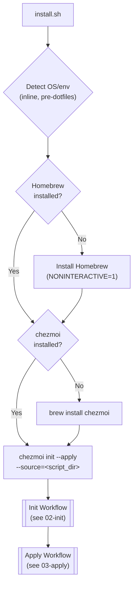

# Bootstrap (`install.sh`)

Full machine setup from scratch — installs prerequisites then delegates to chezmoi.

```mermaid
flowchart TD
    A["install.sh"] --> B{"Detect OS/env<br/>(inline, pre-dotfiles)"}
    B --> C{"Homebrew<br/>installed?"}
    C -- No --> D["Install Homebrew<br/>(NONINTERACTIVE=1)"]
    C -- Yes --> E{"chezmoi<br/>installed?"}
    D --> E
    E -- No --> F["brew install chezmoi"]
    E -- Yes --> G["chezmoi init --apply<br/>--source=&lt;script_dir&gt;"]
    F --> G
    G --> H[["Init Workflow<br/>(see 02-init)"]]
    H --> I[["Apply Workflow<br/>(see 03-apply)"]]
```
