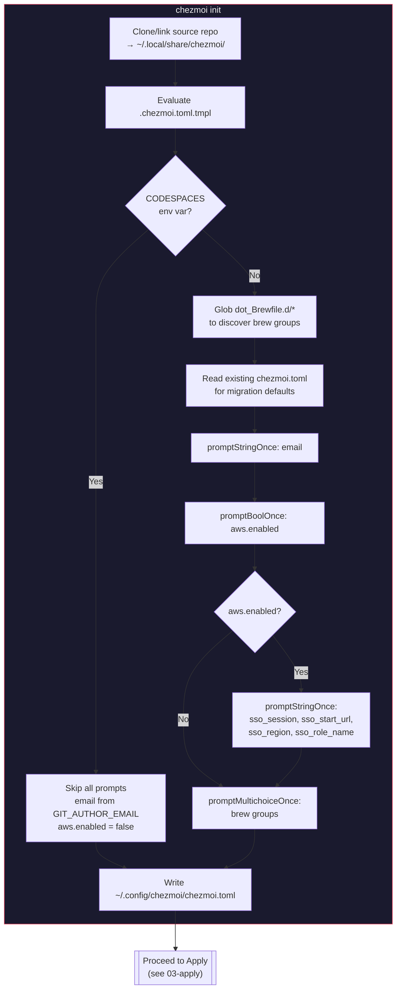

# Init Workflow (`chezmoi init`)

Runs `.chezmoi.toml.tmpl` to generate the config file with user-specific data.
Prompts are cached — subsequent runs reuse existing answers.

```mermaid
flowchart TD
    subgraph init ["chezmoi init"]
        A["Clone/link source repo<br/>→ ~/.local/share/chezmoi/"] --> B["Evaluate .chezmoi.toml.tmpl"]

        B --> C{"CODESPACES<br/>env var?"}

        C -- Yes --> D["Skip all prompts<br/>email from GIT_AUTHOR_EMAIL<br/>aws.enabled = false"]
        C -- No --> E["Glob dot_Brewfile.d/*<br/>to discover brew groups"]

        E --> F["Read existing chezmoi.toml<br/>for migration defaults"]
        F --> G["promptStringOnce: email"]
        G --> H["promptBoolOnce: aws.enabled"]

        H --> I{"aws.enabled?"}
        I -- Yes --> J["promptStringOnce:<br/>sso_session, sso_start_url,<br/>sso_region, sso_role_name"]
        I -- No --> K["promptMultichoiceOnce:<br/>brew groups"]
        J --> K

        D --> L
        K --> L["Write ~/.config/chezmoi/chezmoi.toml"]
    end

    L --> M[["Proceed to Apply<br/>(see 03-apply)"]]

    style init fill:#1a1a2e,stroke:#e94560,color:#eee
```
