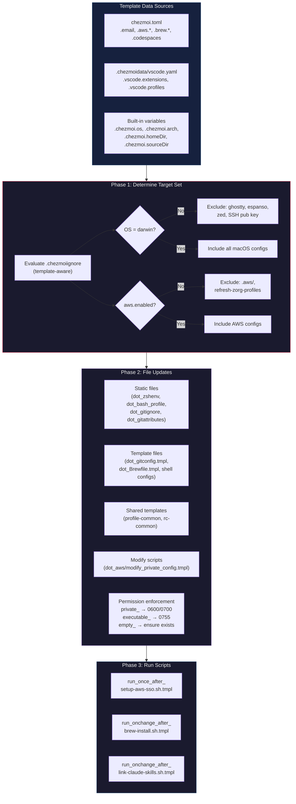

# Apply Workflow (`chezmoi apply`)

Idempotent — safe to run repeatedly. Renders templates, syncs files, and runs scripts.

```mermaid
flowchart TD
    subgraph data ["Template Data Sources"]
        TD1["chezmoi.toml<br/>.email, .aws.*, .brew.*, .codespaces"]
        TD2[".chezmoidata/vscode.yaml<br/>.vscode.extensions, .vscode.profiles"]
        TD3["Built-in variables<br/>.chezmoi.os, .chezmoi.arch,<br/>.chezmoi.homeDir, .chezmoi.sourceDir"]
    end

    subgraph phase1 ["Phase 1: Determine Target Set"]
        A["Evaluate .chezmoiignore<br/>(template-aware)"]
        A --> B{"OS = darwin?"}
        B -- No --> C["Exclude: ghostty, espanso,<br/>zed, SSH pub key"]
        B -- Yes --> D["Include all macOS configs"]
        A --> E{"aws.enabled?"}
        E -- No --> F["Exclude: .aws/,<br/>refresh-zorg-profiles"]
        E -- Yes --> G["Include AWS configs"]
    end

    subgraph phase2 ["Phase 2: File Updates"]
        H["Static files<br/>(dot_zshenv, dot_bash_profile,<br/>dot_gitignore, dot_gitattributes)"]
        I["Template files<br/>(dot_gitconfig.tmpl,<br/>dot_Brewfile.tmpl, shell configs)"]
        J["Shared templates<br/>(profile-common, rc-common)"]
        K["Modify scripts<br/>(dot_aws/modify_private_config.tmpl)"]
        L["Permission enforcement<br/>private_ → 0600/0700<br/>executable_ → 0755<br/>empty_ → ensure exists"]
    end

    subgraph phase3 ["Phase 3: Run Scripts"]
        M["run_once_after_<br/>setup-aws-sso.sh.tmpl"]
        N["run_onchange_after_<br/>brew-install.sh.tmpl"]
        O["run_onchange_after_<br/>link-claude-skills.sh.tmpl"]
    end

    data --> phase1
    phase1 --> phase2
    phase2 --> phase3

    style data fill:#16213e,stroke:#0f3460,color:#eee
    style phase1 fill:#1a1a2e,stroke:#e94560,color:#eee
    style phase2 fill:#1a1a2e,stroke:#533483,color:#eee
    style phase3 fill:#1a1a2e,stroke:#0f3460,color:#eee
```
