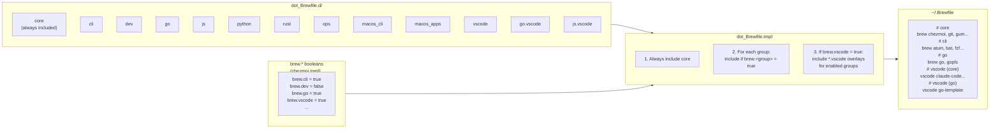
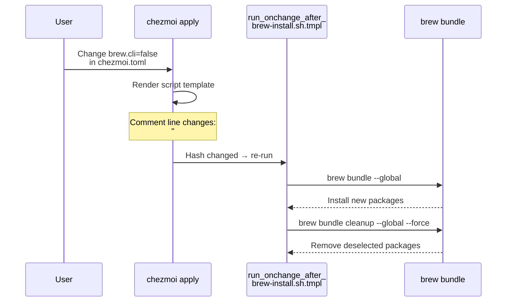

# Brewfile Assembly

The `dot_Brewfile.tmpl` dynamically composes `~/.Brewfile` from fragments based on selected brew groups.

## Change Detection

Changing brew selections in `chezmoi.toml` triggers automatic package sync on next apply.

