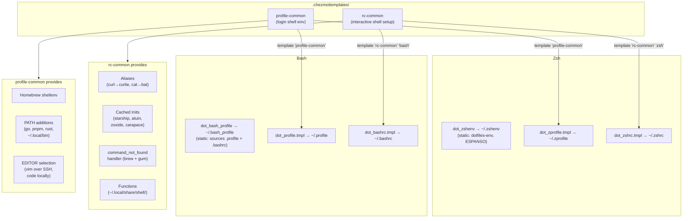

# Shell Config Inheritance

How shell configuration files compose using shared templates.

```mermaid
flowchart TD
    subgraph templates [".chezmoitemplates/"]
        PC["profile-common<br/>(login shell env)"]
        RC["rc-common<br/>(interactive shell setup)"]
    end

    subgraph zsh ["Zsh"]
        ZE["dot_zshenv → ~/.zshenv<br/>(static: dotfiles-env, ESPANSO)"]
        ZP["dot_zprofile.tmpl → ~/.zprofile"]
        ZR["dot_zshrc.tmpl → ~/.zshrc"]
    end

    subgraph bash ["Bash"]
        BP["dot_bash_profile → ~/.bash_profile<br/>(static: sources .profile + .bashrc)"]
        PR["dot_profile.tmpl → ~/.profile"]
        BR["dot_bashrc.tmpl → ~/.bashrc"]
    end

    PC -->|"template 'profile-common'"| ZP
    PC -->|"template 'profile-common'"| PR
    RC -->|"template 'rc-common' 'zsh'"| ZR
    RC -->|"template 'rc-common' 'bash'"| BR

    subgraph rc_provides ["rc-common provides"]
        direction LR
        AL["Aliases<br/>(curl→curlie, cat→bat)"]
        CI["Cached Inits<br/>(starship, atuin,<br/>zoxide, carapace)"]
        CN["command_not_found<br/>handler (brew + gum)"]
        FF["Functions<br/>(~/.local/share/shell/)"]
    end

    subgraph pc_provides ["profile-common provides"]
        direction LR
        HB["Homebrew shellenv"]
        PA["PATH additions<br/>(go, pnpm, rust,<br/>~/.local/bin)"]
        ED["EDITOR selection<br/>(vim over SSH,<br/>code locally)"]
    end

    RC --> rc_provides
    PC --> pc_provides
```
