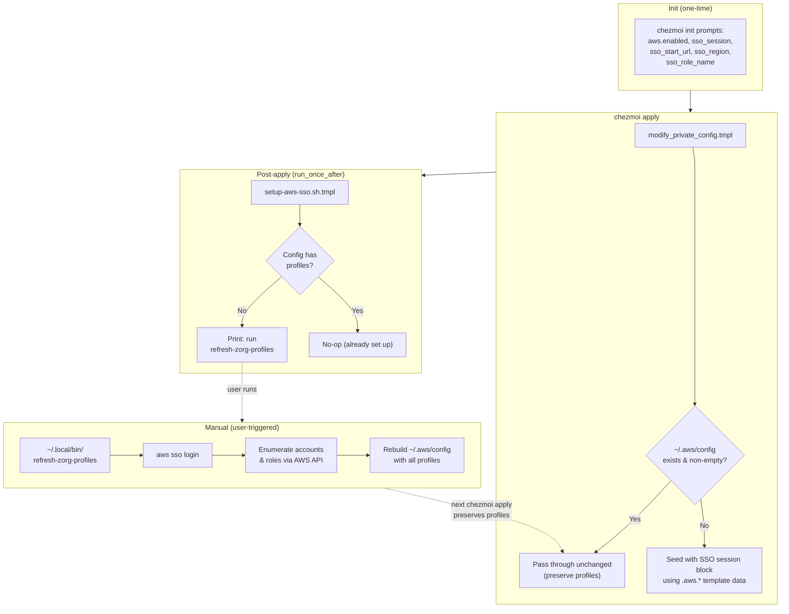

# AWS Configuration Flow

Conditional AWS setup: seed-once config, SSO login, and profile discovery.

```mermaid
flowchart TD
    subgraph init ["Init (one-time)"]
        A["chezmoi init prompts:<br/>aws.enabled, sso_session,<br/>sso_start_url, sso_region,<br/>sso_role_name"]
    end

    subgraph apply ["chezmoi apply"]
        B["modify_private_config.tmpl"]
        B --> C{"~/.aws/config<br/>exists & non-empty?"}
        C -- Yes --> D["Pass through unchanged<br/>(preserve profiles)"]
        C -- No --> E["Seed with SSO session block<br/>using .aws.* template data"]
    end

    subgraph post ["Post-apply (run_once_after)"]
        F["setup-aws-sso.sh.tmpl"]
        F --> G{"Config has<br/>profiles?"}
        G -- No --> H["Print: run<br/>refresh-zorg-profiles"]
        G -- Yes --> I["No-op (already set up)"]
    end

    subgraph manual ["Manual (user-triggered)"]
        J["~/.local/bin/<br/>refresh-zorg-profiles"]
        J --> K["aws sso login"]
        K --> L["Enumerate accounts<br/>& roles via AWS API"]
        L --> M["Rebuild ~/.aws/config<br/>with all profiles"]
    end

    init --> apply
    apply --> post
    H -.->|"user runs"| manual
    manual -.->|"next chezmoi apply<br/>preserves profiles"| D
```
