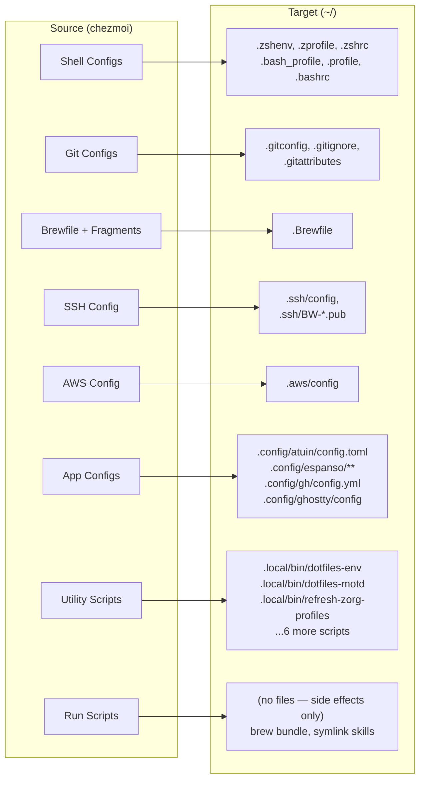

# Complete File Map

All managed targets grouped by category.

```mermaid
flowchart LR
    subgraph source ["Source (chezmoi)"]
        direction TB
        S1["Shell Configs"]
        S2["Git Configs"]
        S3["Brewfile + Fragments"]
        S4["SSH Config"]
        S5["AWS Config"]
        S6["App Configs"]
        S7["Utility Scripts"]
        S8["Run Scripts"]
    end

    subgraph target ["Target (~/)"]
        direction TB
        T1[".zshenv, .zprofile, .zshrc<br/>.bash_profile, .profile, .bashrc"]
        T2[".gitconfig, .gitignore,<br/>.gitattributes"]
        T3[".Brewfile"]
        T4[".ssh/config,<br/>.ssh/BW-*.pub"]
        T5[".aws/config"]
        T6[".config/atuin/config.toml<br/>.config/espanso/**<br/>.config/gh/config.yml<br/>.config/ghostty/config"]
        T7[".local/bin/dotfiles-env<br/>.local/bin/dotfiles-motd<br/>.local/bin/refresh-zorg-profiles<br/>...6 more scripts"]
        T8["(no files — side effects only)<br/>brew bundle, symlink skills"]
    end

    S1 --> T1
    S2 --> T2
    S3 --> T3
    S4 --> T4
    S5 --> T5
    S6 --> T6
    S7 --> T7
    S8 --> T8
```
