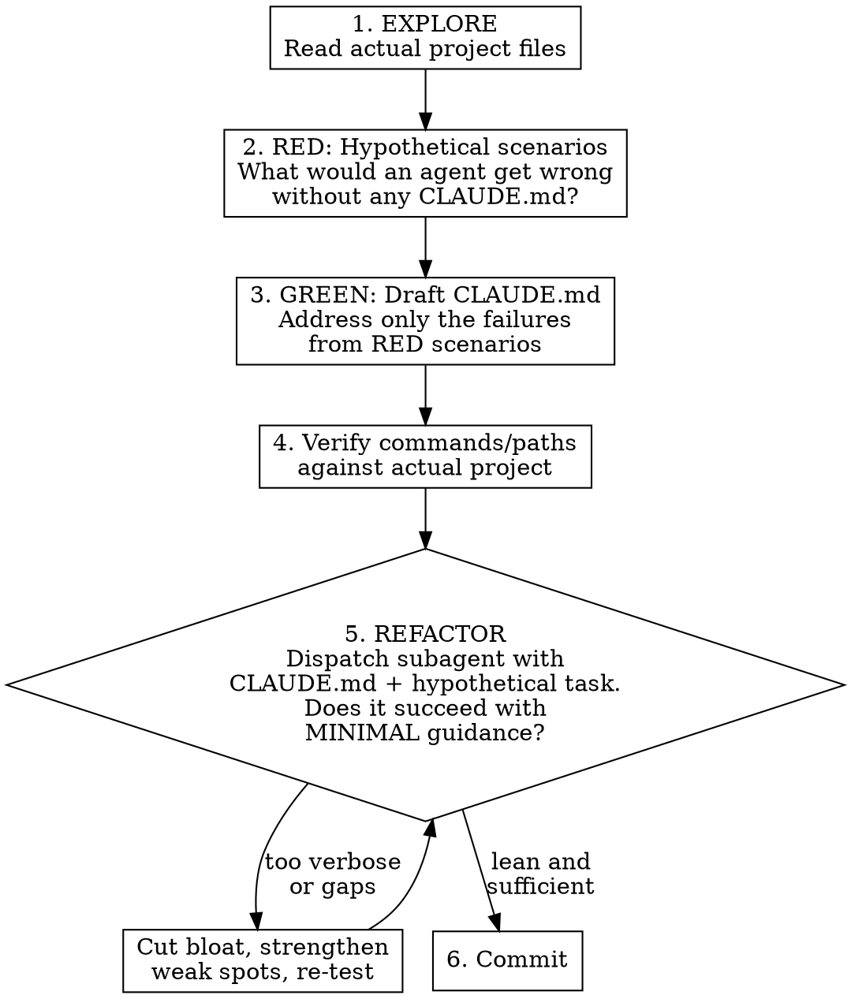

# Writing CLAUDE.md

## Overview

CLAUDE.md is loaded into every conversation. Every token competes with your actual work. Write only what the agent can't figure out on its own, verify everything against the real project, and prefer pointers over paragraphs.

**Iron rule:** Explore first, write second. Never generate CLAUDE.md content from descriptions alone.

## When to Use

- Creating CLAUDE.md or AGENTS.md for a new project
- Rewriting one that's outdated or bloated
- Agents keep making the same mistakes in a codebase
- Onboarding a new tool, convention, or architectural pattern

## Process: RED-GREEN-REFACTOR for Documentation

Writing CLAUDE.md is TDD applied to project documentation. You write hypothetical scenarios (tests), check if an agent would succeed without the doc (RED), write the doc (GREEN), then pressure-test and pare down (REFACTOR).



### 1. EXPLORE: Read the Project

**Before writing a single line**, read actual files:
- Config files: `package.json`, `Makefile`, `pyproject.toml`, `go.mod`, `Cargo.toml`, etc.
- Existing docs: README, CONTRIBUTING, existing CLAUDE.md
- CI config: `.github/workflows/`, `.gitlab-ci.yml`, etc.
- Directory structure (actual `ls`, not imagined)

**Never fabricate paths, commands, or structure.** If you haven't read it, don't write it.

### 2. RED: Identify What Agents Get Wrong

Before drafting, think through hypothetical scenarios where an agent working in this project would fail without guidance. These are your "failing tests."

**Ask yourself for each area of the project:**
- Would an agent know the correct build/test/lint commands?
- Would an agent put new code in the right directory?
- Would an agent follow the project's naming conventions?
- Would an agent avoid editing generated or protected files?
- Would an agent know the non-obvious architectural constraints?

**Document specific failures**, not vague concerns:
- "Agent would run `npm test` but the project uses `make test` which also generates fixtures"
- "Agent would put business logic in handlers instead of domain/"
- "Agent would edit `~/.aws/config` directly instead of using the modify script"

Only information that meets **at least one** of these criteria belongs in CLAUDE.md:

| Include | Example |
|---------|---------|
| Agent can't infer it | "Run `make gen` after changing .proto files" |
| Agent keeps getting it wrong | "Business logic goes in domain/, NOT handlers/" |
| It's project-specific and non-obvious | "We use workspace protocol for shared deps" |
| It prevents a costly mistake | "Never edit files under generated/" |

### 3. GREEN: Draft Minimal CLAUDE.md

Write CLAUDE.md addressing **only** the failures from step 2. Don't add content for hypothetical cases you didn't identify.

**What does NOT belong:**

| Exclude | Why |
|---------|-----|
| How common tools work | Claude knows git, pytest, npm, Go modules |
| Project structure trees | Agent can `ls` — structure changes often |
| Lists of env vars | These belong in `.env.example` — reference that file instead |
| Verbose code examples | Point to an exemplar file in the codebase |
| Explanations of frameworks | Claude knows React, FastAPI, gRPC, etc. |
| Time-sensitive information | Version numbers, dates, "current" API endpoints |
| Anything in README or CONTRIBUTING | Reference those files, don't duplicate |

**Token efficiency — reference, don't inline:**
```markdown
# BAD (50 tokens)
Commit messages must follow conventional commits format:
<type>(<scope>): <description>
Types: feat, fix, chore, docs, refactor, test, ci, perf

# GOOD (10 tokens)
Commit messages: conventional commits format.
```

**Point to exemplars, not descriptions. Use the project's own files as docs.**

**Structure template:**
```markdown
# CLAUDE.md

## Build/Test/Lint
[Only commands that aren't obvious from config files]

## Architecture Decisions
[Only non-obvious constraints agents violate]

## Common Mistakes
[Only if agents actually make these mistakes]

## References
[Pointers to files that contain detailed guidance]
```

Keep total CLAUDE.md under 200 lines. If you need more, split into referenced files.

### 4. Verify Commands and Paths

Every command, path, and file reference in your draft must be verified against the actual project. Run commands, check paths exist, confirm file contents match your descriptions.

### 5. REFACTOR: Subagent Pressure Testing

This is the critical step that distinguishes good CLAUDE.md from bloated ones. Dispatch subagents with your draft CLAUDE.md and realistic project tasks. The goal is to answer two questions:

1. **Is every line earning its keep?** If the agent succeeds without reading a section, cut it.
2. **Are there gaps?** If the agent fails at something the CLAUDE.md should have prevented, strengthen it.

**How to test with subagents:**

Dispatch 2-3 subagents in parallel, each with a different realistic task for the project. Give each subagent the CLAUDE.md content as context and a task that exercises the non-obvious parts of the project.

```
You are working in [project]. Here is the project's CLAUDE.md:

[paste draft CLAUDE.md]

TASK: [realistic task that would exercise non-obvious project constraints]

Think through how you would approach this task step by step.
What commands would you run? Where would you put new code?
What mistakes might you make?
```

**Good test tasks:**
- Add a new feature touching the project's non-obvious build pipeline
- Fix a bug in an area with architectural constraints
- Add a new file following the project's conventions
- Run the test suite and interpret results

**Evaluate each subagent's response:**
- Did it follow the correct build/test commands?
- Did it put code in the right places?
- Did it avoid the common mistakes?
- Did it reference the right exemplar files?
- Did it use information from CLAUDE.md that it couldn't have inferred?

**Then pare down:**
- Lines the agent didn't need → **cut them**
- Lines the agent relied on and got right → **keep them**
- Tasks where the agent still failed → **strengthen that section**
- Sections that duplicate discoverable info → **replace with pointer**

**Iterate** until the CLAUDE.md is the minimum viable documentation: every line prevents a real failure, no line is dead weight.

### 6. Maintaining Over Time

CLAUDE.md should be updated when:
- Agents repeatedly make the same mistake (add a rule)
- A rule no longer applies (remove it)
- A referenced file moves or is deleted (fix the pointer)

Do NOT update CLAUDE.md for:
- Routine dependency upgrades
- Adding new files (agents can discover them)
- Changes already captured in config files

## Red Flags — STOP and Reconsider

- Writing CLAUDE.md without having explored the project files first
- Including a "Project Structure" tree you generated from memory
- Explaining how a well-known tool works
- Copying content from README into CLAUDE.md
- CLAUDE.md exceeding 200 lines
- Including version numbers or dates that will go stale
- Writing detailed code examples when you could point to a file
- Being asked for "comprehensive" docs for a project with minimal code — CLAUDE.md should match the project's actual maturity

## Common Mistakes

| Mistake | Fix |
|---------|-----|
| Fabricating commands/paths | Read config files first, verify each command |
| Explaining what Claude already knows | Remove it — trust the model |
| Inlining volatile information | Reference the source file instead |
| "Comprehensive" CLAUDE.md | Ruthlessly cut — only non-obvious, verified content |
| No maintenance plan | Treat like code — update when behavior changes, remove when obsolete |

## CLAUDE.md vs AGENTS.md

| CLAUDE.md | AGENTS.md |
|-----------|-----------|
| Claude Code specific instructions | Agent-agnostic project guidance |
| Workflow preferences, tool config | Build commands, architecture rules, conventions |
| Can reference AGENTS.md with `@AGENTS.md` | Standalone — works with any agent tool |

Use AGENTS.md when guidance applies to multiple agent tools. Use CLAUDE.md for Claude Code-specific behavior. CLAUDE.md can `@import` AGENTS.md to avoid duplication.
