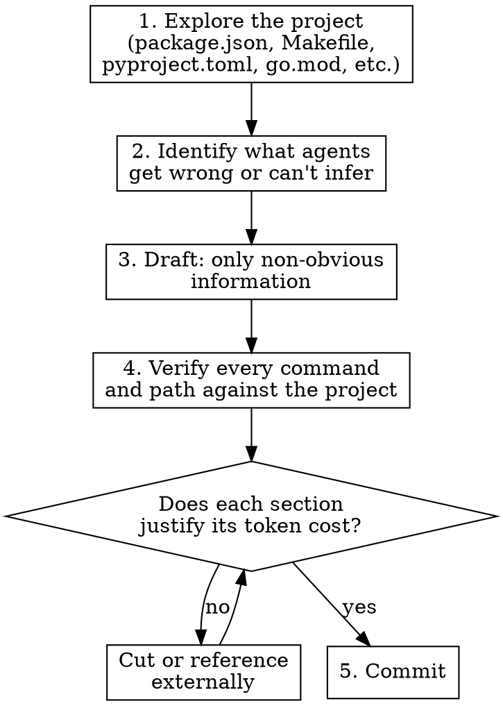

# Writing CLAUDE.md

## Overview

CLAUDE.md is loaded into every conversation. Every token competes with your actual work. Write only what the agent can't figure out on its own, verify everything against the real project, and prefer pointers over paragraphs.

**Iron rule:** Explore first, write second. Never generate CLAUDE.md content from descriptions alone.

## When to Use

- Creating CLAUDE.md or AGENTS.md for a new project
- Rewriting one that's outdated or bloated
- Agents keep making the same mistakes in a codebase
- Onboarding a new tool, convention, or architectural pattern

## Process



### 1. Explore First

**Before writing a single line**, read the project's actual files:
- Config files: `package.json`, `Makefile`, `pyproject.toml`, `go.mod`, `Cargo.toml`, etc.
- Existing docs: README, CONTRIBUTING, existing CLAUDE.md
- CI config: `.github/workflows/`, `.gitlab-ci.yml`, etc.
- Directory structure (actual `ls`, not imagined)

**Never fabricate paths, commands, or structure.** If you haven't read it, don't write it.

If the project doesn't exist or you can't access it, say so in one sentence and stop. Don't write a lengthy explanation — just explore or ask.

### 2. What Belongs in CLAUDE.md

Only include information that meets **at least one** of:

| Include | Example |
|---------|---------|
| Agent can't infer it | "Run `make gen` after changing .proto files" |
| Agent keeps getting it wrong | "Business logic goes in domain/, NOT handlers/" |
| It's project-specific and non-obvious | "We use workspace protocol for shared deps" |
| It prevents a costly mistake | "Never edit files under generated/" |

### 3. What Does NOT Belong

| Exclude | Why |
|---------|-----|
| How common tools work | Claude knows git, pytest, npm, Go modules |
| Project structure trees | Agent can `ls` — structure changes often |
| Lists of env vars | These belong in `.env.example` — reference that file instead |
| Verbose code examples | Point to an exemplar file in the codebase |
| Explanations of frameworks | Claude knows React, FastAPI, gRPC, etc. |
| Time-sensitive information | Version numbers, dates, "current" API endpoints |
| Anything in README or CONTRIBUTING | Reference those files, don't duplicate |

### 4. Token Efficiency Techniques

**Reference, don't inline:**
```markdown
# BAD (50 tokens burned)
Commit messages must follow conventional commits format:
<type>(<scope>): <description>
Types: feat, fix, chore, docs, refactor, test, ci, perf

# GOOD (10 tokens)
Commit messages: conventional commits format.
```

**Point to exemplars, don't describe patterns:**
```markdown
# BAD (100+ tokens)
gRPC handlers should validate input, call domain service,
translate response. Do not put business logic in handlers...
[paragraph continues]

# GOOD (20 tokens)
Handler pattern: follow services/users/handler.go as exemplar.
Never put business logic in handlers — domain/ only.
```

**Use the project's own files as documentation:**
```markdown
# BAD
Available commands: dev, build, test, lint, format...
[lists every command with flags]

# GOOD
Commands: see `Makefile` (or `package.json` scripts).
```

### 5. Structure Template

```markdown
# CLAUDE.md

## Build/Test/Lint
[Only commands that aren't obvious from config files]

## Architecture Decisions
[Only non-obvious constraints agents violate]

## Common Mistakes
[Only if agents actually make these mistakes]

## References
[Pointers to files that contain detailed guidance]
```

Keep total CLAUDE.md under 200 lines. If you need more, split into referenced files.

### 6. Maintaining Over Time

CLAUDE.md should be updated when:
- Agents repeatedly make the same mistake (add a rule)
- A rule no longer applies (remove it)
- A referenced file moves or is deleted (fix the pointer)

Do NOT update CLAUDE.md for:
- Routine dependency upgrades
- Adding new files (agents can discover them)
- Changes already captured in config files

## Red Flags — STOP and Reconsider

- Writing CLAUDE.md without having explored the project files first
- Including a "Project Structure" tree you generated from memory
- Explaining how a well-known tool works
- Copying content from README into CLAUDE.md
- CLAUDE.md exceeding 200 lines
- Including version numbers or dates that will go stale
- Writing detailed code examples when you could point to a file
- Being asked for "comprehensive" docs for a project with minimal code — CLAUDE.md should match the project's actual maturity

## Common Mistakes

| Mistake | Fix |
|---------|-----|
| Fabricating commands/paths | Read config files first, verify each command |
| Explaining what Claude already knows | Remove it — trust the model |
| Inlining volatile information | Reference the source file instead |
| "Comprehensive" CLAUDE.md | Ruthlessly cut — only non-obvious, verified content |
| No maintenance plan | Treat like code — update when behavior changes, remove when obsolete |

## CLAUDE.md vs AGENTS.md

| CLAUDE.md | AGENTS.md |
|-----------|-----------|
| Claude Code specific instructions | Agent-agnostic project guidance |
| Workflow preferences, tool config | Build commands, architecture rules, conventions |
| Can reference AGENTS.md with `@AGENTS.md` | Standalone — works with any agent tool |

Use AGENTS.md when guidance applies to multiple agent tools. Use CLAUDE.md for Claude Code-specific behavior. CLAUDE.md can `@import` AGENTS.md to avoid duplication.
